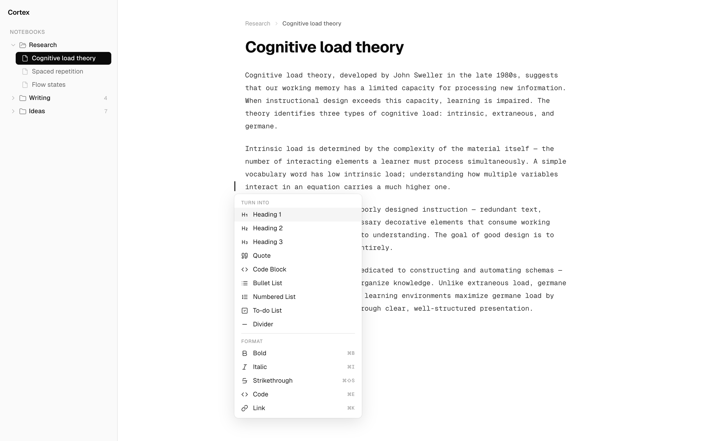

<p align="center">
  
</p>

<h1 align="center">Cortex</h1>

<p align="center">
  Give your AI coding tools access to your Obsidian vault.
</p>

---

## ✦ Meet Cortex — AI Native Notes

<p align="center">
  
</p>

A free, native desktop app for notes that actually work with your AI tools. No cloud, no subscription, no data mining — everything stays on your machine.

- **Free forever** — no trials, no paywalls
- **Offline-first** — your notes live on your filesystem, period
- **AI when you want it** — bring your own keys, 10+ providers, fully optional
- **Built for builders** — rich editor, version history, notebooks, tags, vector search

**[Get Cortex — it's free →](https://get-cortex.app)**

---

*Already using Obsidian? This plugin brings the same AI-native philosophy to your vault. ↓*

## What it does

Cortex runs a local [MCP](https://modelcontextprotocol.io) server inside Obsidian, exposing 9 tools for reading, writing, searching, and organizing notes. Any MCP-compatible client — Claude Code, Codex, OpenCode — can connect over HTTP and work with your vault.

## Quick start

1. Install from **Obsidian Community Plugins** (search "Cortex")
2. Enable the plugin — the server auto-starts on port `27182`
3. Connect your client:

### Claude Code

```sh
claude mcp add cortex --transport http --url http://127.0.0.1:27182/mcp
```

### Codex

```sh
codex mcp add cortex --url http://127.0.0.1:27182/mcp
```

### OpenCode

Add to the `mcp` section of your `opencode.json`:

```json
{
  "cortex": {
    "type": "remote",
    "url": "http://127.0.0.1:27182/mcp"
  }
}
```

## Available tools

| Tool | Description |
|------|-------------|
| `read_note` | Read the content of a note by its vault path |
| `write_note` | Create or overwrite a note at the given path |
| `edit_note` | Append, prepend, or find-and-replace in a note |
| `search_notes` | Full-text search across notes in the vault |
| `list_notes` | List notes, optionally filtered by folder |
| `get_note_metadata` | Get frontmatter, tags, links, and headings |
| `delete_note` | Delete a note (moves to trash by default) |
| `list_tags` | List all tags in the vault with their frequency |
| `list_folders` | List folders in the vault |

## Configuration

Open **Settings → Cortex** to configure:

- **Port** — HTTP port for the MCP server (default `27182`, requires restart)
- **Auto-start** — Start the server when Obsidian launches (default on)

## Security

- Binds to `127.0.0.1` only — no remote access by default
- Traffic stays on your machine

## Build from source

```sh
npm install
npm run build
```

Copy `main.js`, `manifest.json`, and `styles.css` into your vault at `.obsidian/plugins/cortex/`.

